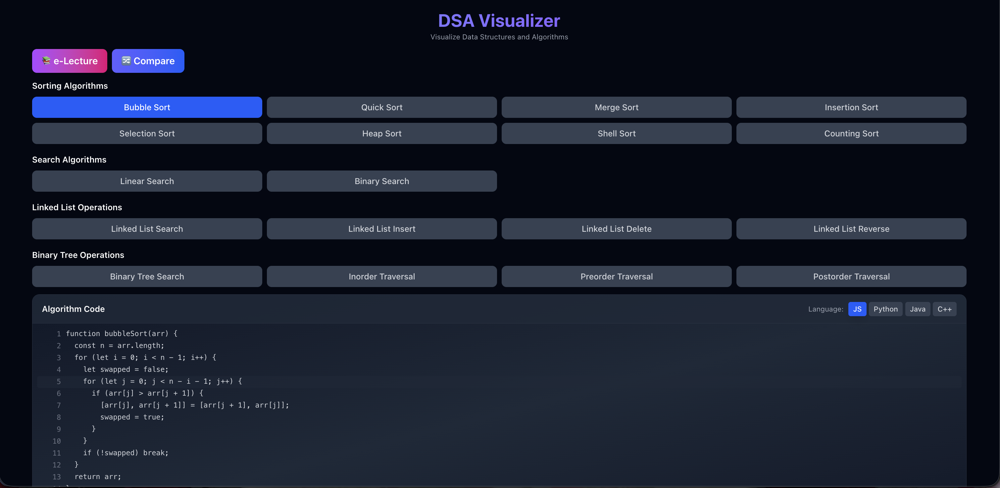
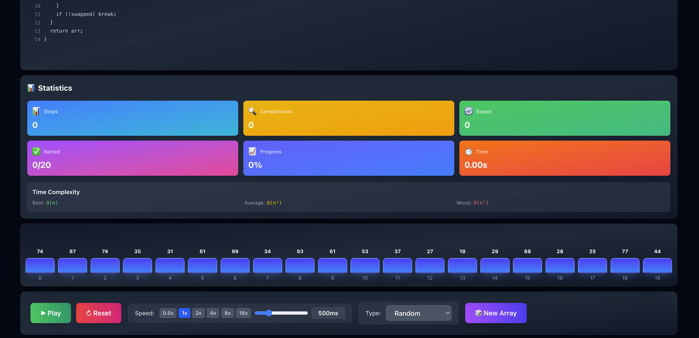
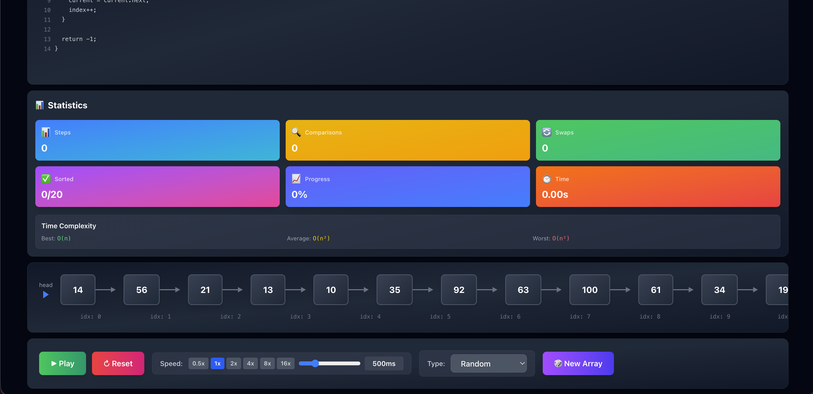
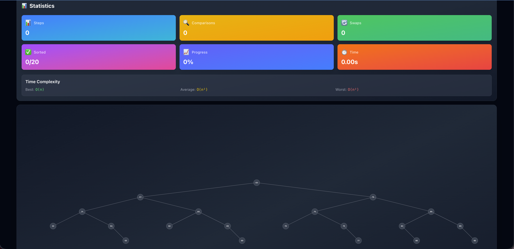

# 🎨 AlgoLab - Interactive DSA Visualizer

<div align="center">


**Visualize Data Structures & Algorithms with real-time code animation synchronized with visualization. Includes sorting, searching, linked lists, and binary trees.**

🌐 **[Live Demo](https://technoblogger14o3.github.io/AlgoLab/)** • [Features](#-features) • [Demo](#-demo) • [Installation](#-installation) • [Usage](#-usage) • [Algorithms](#-algorithms) • [Tech Stack](#-tech-stack)

</div>

---

## 🌐 Live Demo

**👉 [Try AlgoLab Now - Live Site](https://technoblogger14o3.github.io/AlgoLab/)**

Experience the interactive visualizer with all algorithms and data structures! The site is fully deployed and ready to use.

## ✨ Features

### 🎯 Algorithm Visualization
- **18+ Algorithms**: Visualize 8 sorting algorithms, 2 search algorithms, 4 linked list operations, and 4 binary tree operations
- **Real-time Code Animation**: Synchronized code highlighting with algorithm execution
- **Multi-language Support**: View algorithm code in JavaScript, Python, Java, and C++
- **Statistics Panel**: Track steps, comparisons, swaps, and execution time
- **Performance Metrics**: See complexity analysis and completion statistics

### 🔗 Data Structure Visualizations
- **Linked Lists**: Visualize search, insert, delete, and reverse operations
- **Binary Trees**: Explore search and tree traversals (inorder, preorder, postorder)
- **Interactive Nodes**: See data structure operations step-by-step with visual feedback

### 🎮 Interactive Controls
- **Play/Pause/Reset**: Full control over algorithm execution
- **Speed Presets**: Quick access to 0.5x, 1x, 2x, 4x, 8x, 16x speeds
- **Custom Speed**: Fine-tune animation speed from 0ms to 2000ms
- **Array Customization**: Generate random, sorted, reversed, or nearly sorted arrays

### 📊 Advanced Features
- **Side-by-Side Comparison**: Compare two algorithms simultaneously
- **e-Lecture Mode**: Educational explanations and algorithm insights
- **Code Display**: View algorithm implementations in multiple languages
- **Responsive Design**: Works seamlessly on desktop and mobile devices

## 🎬 Demo

<div align="center">

### Video Demo

Watch the full demo video: [`demo.mov`](./src/screenshots/demo.mov)

*Note: The demo video showcases all features including sorting algorithms, search algorithms, linked list operations, and binary tree visualizations.*

### Screenshots


*Main interface with algorithm visualization*


*Side-by-side algorithm comparison*


*Linked List operations visualization*


*Binary Tree traversal visualization*

</div>

## 🚀 Quick Start

### Prerequisites

- Node.js 20.19+ or 22.12+
- npm or yarn

### Installation

1. **Clone the repository**
   ```bash
   git clone https://github.com/TechnoBlogger14o3/AlgoLab.git
   cd AlgoLab
   ```

2. **Install dependencies**
   ```bash
   npm install
   ```

3. **Start the development server**
   ```bash
   npm run dev
   ```

4. **Open your browser**
   Navigate to `http://localhost:5173`

## 📖 Usage Guide

### Visualizing Sorting Algorithms

1. **Select an Algorithm**: Choose from Bubble Sort, Quick Sort, Merge Sort, etc.
2. **Generate Array**: Click "Generate New Array" to create a random array
3. **Start Visualization**: Click the "Play" button to start the animation
4. **Control Speed**: Use speed presets or the custom slider
5. **View Statistics**: Watch real-time metrics like steps, swaps, and comparisons

### Visualizing Search Algorithms

1. **Select Search Algorithm**: Choose Linear Search or Binary Search
2. **Set Target**: Enter the value you want to search for
3. **Start Search**: Click "Play" to visualize the search process
4. **View Results**: See step count and complexity when the target is found

### Linked List Operations

1. **Select Operation**: Choose Search, Insert, Delete, or Reverse
2. **View Structure**: The linked list displays automatically
3. **Start Operation**: Click "Play" to see the operation step-by-step
4. **Track Progress**: Watch nodes being traversed and modified

### Binary Tree Operations

1. **Select Operation**: Choose Search or a Traversal (Inorder, Preorder, Postorder)
2. **View Tree**: The binary tree structure displays automatically
3. **Start Visualization**: Click "Play" to see the traversal or search
4. **Follow Path**: Watch nodes being visited with color-coded feedback

### Comparison Mode

1. **Open Comparison**: Click the "Compare" button
2. **Select Algorithms**: Choose two different algorithms to compare
3. **Start Comparison**: Watch both algorithms run side-by-side
4. **Analyze Performance**: Compare statistics, steps, and execution time

## 🔢 Algorithms

### Sorting Algorithms (8)

| Algorithm | Time Complexity (Best) | Time Complexity (Worst) | Space Complexity | Description |
|-----------|------------------------|--------------------------|------------------|-------------|
| **Bubble Sort** | O(n) | O(n²) | O(1) | Compare adjacent elements and swap if needed |
| **Quick Sort** | O(n log n) | O(n²) | O(log n) | Divide and conquer with pivot partitioning |
| **Merge Sort** | O(n log n) | O(n log n) | O(n) | Divide array into halves and merge |
| **Insertion Sort** | O(n) | O(n²) | O(1) | Build sorted array one element at a time |
| **Selection Sort** | O(n²) | O(n²) | O(1) | Find minimum and place at beginning |
| **Heap Sort** | O(n log n) | O(n log n) | O(1) | Use heap data structure to sort |
| **Shell Sort** | O(n log n) | O(n²) | O(1) | Improved insertion sort with gaps |
| **Counting Sort** | O(n + k) | O(n + k) | O(k) | Count occurrences of each value |

### Search Algorithms (2)

| Algorithm | Time Complexity (Best) | Time Complexity (Worst) | Space Complexity | Description |
|-----------|------------------------|--------------------------|------------------|-------------|
| **Linear Search** | O(1) | O(n) | O(1) | Check each element sequentially |
| **Binary Search** | O(1) | O(log n) | O(1) | Search in sorted array by dividing in half |

### Linked List Operations (4)

| Operation | Time Complexity | Space Complexity | Description |
|-----------|----------------|------------------|-------------|
| **Search** | O(n) | O(1) | Find a value in the linked list |
| **Insert at Head** | O(1) | O(1) | Add a new node at the beginning |
| **Delete** | O(n) | O(1) | Remove a node with specific value |
| **Reverse** | O(n) | O(1) | Reverse the entire linked list |

### Binary Tree Operations (4)

| Operation | Time Complexity | Space Complexity | Description |
|-----------|----------------|------------------|-------------|
| **Search** | O(log n) | O(log n) | Search for a value in BST |
| **Inorder Traversal** | O(n) | O(h) | Left → Root → Right |
| **Preorder Traversal** | O(n) | O(h) | Root → Left → Right |
| **Postorder Traversal** | O(n) | O(h) | Left → Right → Root |

## 🛠️ Tech Stack

- **Frontend Framework**: React 19.2
- **Language**: TypeScript 5.9
- **Build Tool**: Vite 7.2
- **Styling**: Tailwind CSS 4.0
- **Animations**: Framer Motion 12.29
- **Code Highlighting**: Custom line-by-line animation
- **Deployment**: GitHub Pages with GitHub Actions

## 📁 Project Structure

```
AlgoLab/
├── src/
│   ├── algorithms/          # Algorithm implementations (generators)
│   │   ├── bubbleSort.ts
│   │   ├── quickSort.ts
│   │   ├── mergeSort.ts
│   │   ├── insertionSort.ts
│   │   ├── selectionSort.ts
│   │   ├── heapSort.ts
│   │   ├── shellSort.ts
│   │   ├── countingSort.ts
│   │   ├── linearSearch.ts
│   │   ├── binarySearch.ts
│   │   ├── linkedList.ts
│   │   └── binaryTree.ts
│   ├── components/          # React components
│   │   ├── ArrayVisualizer.tsx
│   │   ├── LinkedListVisualizer.tsx
│   │   ├── BinaryTreeVisualizer.tsx
│   │   ├── CodeDisplay.tsx
│   │   ├── Controls.tsx
│   │   ├── AlgorithmSelector.tsx
│   │   ├── StatisticsPanel.tsx
│   │   ├── ComparisonMode.tsx
│   │   └── ELectureMode.tsx
│   ├── utils/               # Utility functions
│   │   ├── arrayUtils.ts
│   │   └── codeExecutor.ts
│   ├── data/                # Algorithm code snippets
│   │   └── algorithmCode.ts
│   ├── types/               # TypeScript type definitions
│   │   └── index.ts
│   ├── screenshots/         # Demo images and videos
│   ├── App.tsx              # Main application component
│   └── main.tsx             # Entry point
├── .github/
│   └── workflows/
│       └── deploy.yml       # GitHub Pages deployment
├── public/                  # Static assets
└── package.json
```

## 🎯 Key Features Explained

### Real-time Code Animation
The code display highlights the current line being executed, making it easy to follow the algorithm's logic step-by-step. Switch between JavaScript, Python, Java, and C++ to see implementations in different languages.

### Data Structure Visualizations
- **Linked Lists**: See nodes connected with pointers, watch insertions and deletions in real-time
- **Binary Trees**: Visualize tree structure with proper node positioning and traversal paths

### Statistics & Performance
Track algorithm performance with detailed metrics:
- Step count
- Number of comparisons
- Number of swaps
- Execution time
- Time and space complexity

### Comparison Mode
Compare two algorithms side-by-side to understand their differences:
- Visual comparison of execution
- Performance metrics for both algorithms
- Real-time statistics

## 🚀 Deployment

This project is automatically deployed to GitHub Pages using GitHub Actions. Every push to the `phase_2` or `main` branch triggers a new deployment.

**🌐 Live Site**: **[https://technoblogger14o3.github.io/AlgoLab/](https://technoblogger14o3.github.io/AlgoLab/)**

The site is fully functional and ready to use. All features including sorting algorithms, search algorithms, linked list operations, and binary tree visualizations are available.

## 🤝 Contributing

Contributions are welcome! Please feel free to submit a Pull Request.

1. Fork the repository
2. Create your feature branch (`git checkout -b feature/AmazingFeature`)
3. Commit your changes (`git commit -m 'Add some AmazingFeature'`)
4. Push to the branch (`git push origin feature/AmazingFeature`)
5. Open a Pull Request

## 📝 License

This project is open source and available under the [MIT License](LICENSE).

## 👨‍💻 Author

**TechnoBlogger14o3**

- GitHub: [@TechnoBlogger14o3](https://github.com/TechnoBlogger14o3)

## 🙏 Acknowledgments

- Inspired by various algorithm visualization tools
- Built with love for the DSA community
- Special thanks to all contributors and users

---

<div align="center">

**Made with ❤️ using React, TypeScript, and Framer Motion**

⭐ **Star this repo if you find it helpful!**

🌐 **[Live Demo](https://technoblogger14o3.github.io/AlgoLab/)** • [📖 Documentation](#-usage-guide) • [🐛 Report Bug](https://github.com/TechnoBlogger14o3/AlgoLab/issues) • [💡 Request Feature](https://github.com/TechnoBlogger14o3/AlgoLab/issues)

</div>
